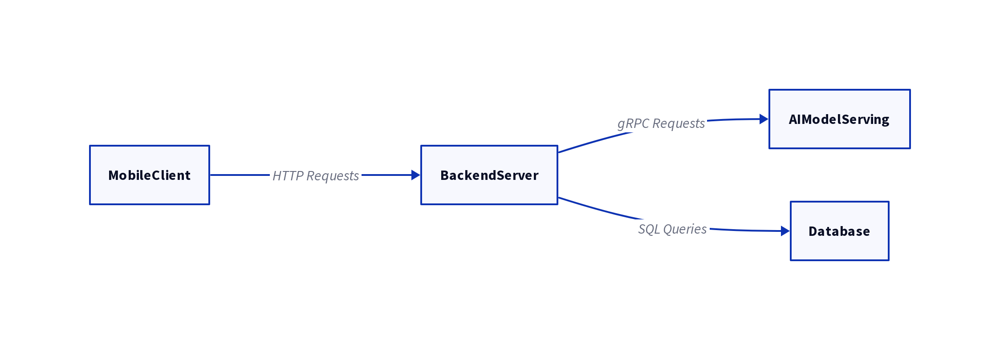

# Wildlife and Plant Identification App Design Document

## 1. Research Findings

This section summarizes the research conducted on open-source datasets for wildlife and plant identification.

### 1.1. Bird and Wildlife Datasets

- **NABirds Dataset**: A comprehensive dataset of 48,000 annotated photographs of 400 North American bird species.
- **European Datasets**: Several datasets covering European birds, plants, and wildlife, including the European Breeding Bird Atlas (EBBA2) and FloraVeg.EU.

### 1.2. Plant and Fungi Datasets

- **PlantNet-300K**: A large dataset of over 300,000 plant images across 1,081 species.
- **UCI Mushroom Dataset**: A dataset containing descriptions of 23 species of gilled mushrooms, but it is not image-based.

### 1.3. Key Challenges

- The lack of comprehensive, open-source image datasets for fungi.
- The need to supplement image datasets with external databases for edibility and herbal benefit information.

## 2. AI Model Architecture

This section details the proposed AI model architecture for the identification app.

### 2.1. Recommended Architecture

A hybrid approach using an ensemble of Convolutional Neural Networks (CNNs) and Vision Transformers (ViT) is recommended. This will leverage the hierarchical feature learning of CNNs and the global relationship modeling of ViTs to achieve high accuracy.

### 2.2. Recommended Models

- **CNNs**: ResNet, Inception-v3, MobileNet
- **ViT**: Standard Vision Transformer models
- **Ensemble**: A combination of the above models, such as the Plant-CNN-ViT architecture.

### 2.3. Frameworks

- **Deep Learning Frameworks**: PyTorch or TensorFlow
- **Model Serving**: TensorFlow Serving

## 3. App Architecture

This section outlines the overall architecture of the application.

### 3.1. System Components

- **Mobile Client**: A cross-platform mobile app for iOS and Android.
- **Backend Server**: A Python-based server to handle business logic and data.
- **AI Model Serving**: A dedicated service for the AI models.
- **Database**: A relational database (PostgreSQL or MySQL) for structured data.

### 3.2. Technology Stack

- **Mobile**: React Native or Flutter
- **Backend**: Flask or Django (Python)
- **Database**: PostgreSQL or MySQL

### 3.3. Architecture Diagram

## 4. User Interface Mockups

This section presents text-based mockups of the app's main screens.

### 4.1. Home Screen

- **[Image of the app logo]**
- **Welcome Message:** "Welcome, [User Name]!"
- **Identify Button:** A large, prominent button with a camera icon, labeled "Identify".
- **Recent Identifications:** A horizontally scrollable list of the user's most recent identifications. Each item in the list should display a thumbnail image of the identified species and its name.
- **Navigation Bar:**
    - **Home:** (Selected)
    - **History:**
    - **Profile:**

### 4.2. Camera Screen

- **Viewfinder:** The majority of the screen will be occupied by the camera's viewfinder.
- **Capture Button:** A large, circular button at the bottom center of the screen to capture an image.
- **Gallery Button:** A small button, likely in the bottom left corner, to allow users to select an image from their device's gallery.
- **Flash Toggle:** An icon to toggle the camera's flash on or off.
- **Switch Camera:** An icon to switch between the front and rear-facing cameras.
- **Identification Tips:** A small, dismissible overlay with tips for taking good identification photos (e.g., "Get as close as you can," "Focus on a single subject").

### 4.3. Identification Results Screen

- **Image Preview:** A small preview of the image submitted by the user.
- **Top Result:**
    - **Species Name:** The most likely species identified by the model (e.g., "Amanita muscaria").
    - **Common Name:** The common name of the species (e.g., "Fly Agaric").
    - **Confidence Score:** A percentage indicating the model's confidence in the identification (e.g., "95% confident").
    - **Edibility Information:** A clear and concise statement about the edibility of the species (e.g., "Poisonous"). This should be prominently displayed with a warning icon if the species is not edible.
    - **Herbal Benefits:** A brief summary of any known herbal benefits, if applicable.
- **Other Possible Matches:** A list of other potential species matches, each with its name, common name, and confidence score.
- **"Not a Match?" Button:** A button that allows the user to report an incorrect identification.
- **Save to Collection Button:** A button to save the identification to the user's collection (history).

### 4.4. History Screen

- **Search Bar:** A search bar to allow users to search for specific identifications in their history.
- **Filter Options:** Buttons or a dropdown menu to filter identifications by type (e.g., "Birds," "Plants," "Fungi") or date.
- **Identification List:** A chronological list of the user's past identifications. Each item in the list should display:
    - A thumbnail image of the identified species.
    - The species name and common name.
    - The date of the identification.
- **Navigation Bar:**
    - **Home:**
    - **History:** (Selected)
    - **Profile:**

